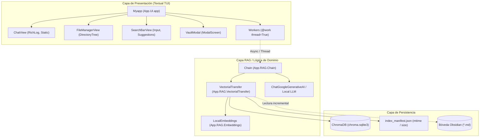

# Guía de Desarrollo para Agentes y Contribuidores: Lazy Obsidian

> **Documento de especificación técnica, arquitectura y directrices de código limpio para el desarrollo autónomo y asistido por IA en `lazy-rag-obsidian`.**

---

## 1. Propósito y Filosofía del Proyecto

**Lazy Obsidian** es una aplicación de terminal (TUI) diseñada para consultar bóvedas de notas de Obsidian en lenguaje natural mediante **RAG local e híbrido**. El usuario introduce una pregunta en su terminal y la aplicación recupera los fragmentos relevantes de sus notas privadas para generar una respuesta concisa, referenciando las fuentes exactas.

### Principios Fundamentales
1. **Velocidad y respuesta inmediata**: Cero latencias innecesarias. La búsqueda y navegación deben sentirse fluidas; la indexación ocurre en segundo plano o de forma incremental.
2. **Terminal-First (TUI moderna)**: Interfaz ergonómica, atractiva y reactiva que no requiera abrir el navegador ni salir de la consola.
3. **Respeto por el recurso local**: Minimizar el consumo de memoria, eliminar dependencias pesadas e innecesarias (ej. evitar NLTK, PyTorch o librerías OCR no indispensables) y usar embeddings por lotes (*batching*).
4. **Local-First & Privacidad**: Las notas y vectores residen localmente; la llamada a LLM se limita a lo estrictamente necesario.

---

## 2. Mapa de Arquitectura

El sistema sigue una arquitectura por capas desacopladas:



### Estructura de Directorios

```text
lazy-rag-obsidian/
├── AGENTS.md               # Esta guía para agentes y desarrolladores
├── README.md               # Documentación general y puesta en marcha
├── OPTIMIZACION.md         # Registro de diagnóstico de performance y mejoras
├── TASK.MD                 # Tareas pendientes del backlog
├── main.py                 # Punto de entrada para ejecución
├── requirements.txt        # Dependencias de Python fijadas
└── App/
    ├── DB/
    │   └── Chroma/         # Almacenamiento vectorial persistente y manifiestos
    ├── RAG/
    │   ├── Chain.py        # Orquestación de recuperación + generación (LCEL)
    │   ├── Embeddings.py   # Cliente Ollama nativo con batching y prefijos
    │   └── VectorialTransfer.py # Sincronización incremental y cliente Chroma
    └── UI/
        ├── app.py          # Clase principal de Textual (Myapp), layout y workers
        ├── theme.py        # Definición de paleta de colores y temas
        ├── CSS/            # Hojas de estilo Textual (TCSS) desacopladas
        └── components/     # Widgets modulares (chat, filemanager, prompt)
```

---

## 3. Especificación Tecnológica: Textual (TUI)

[Textual](https://textual.textualize.io/) es el motor reactivo de interfaz en terminal. Para mantener la aplicación responsiva, rápida y mantenible, todos los agentes deben ceñirse a las siguientes directrices:

### 3.1. Regla de Oro: Nunca Bloquear el Event Loop
Textual corre sobre un bucle de eventos asíncrono en el hilo principal. **Cualquier operación que tarde más de 16 ms (I/O de disco, consultas vectoriales, cálculo de embeddings, llamadas HTTP a Gemini u Ollama) DEBE ejecutarse en un Worker de segundo plano.**

```python
# ❌ INCORRECTO: Congela la interfaz completa
@on(Input.Submitted, "#message")
def on_submit(self, event: Input.Submitted) -> None:
    respuesta = self.chain.search(event.value)  # ¡BLOQUEO DE TUI!
    self.chat.add_assistant_message(respuesta)

# ✅ CORRECTO: Ejecuta en worker desacoplado
@on(Input.Submitted, "#message")
def on_submit(self, event: Input.Submitted) -> None:
    query = event.value.strip()
    if not query:
        return
    self._set_busy(True)
    self.run_search_worker(query)

@work(thread=True, exclusive=True, group="search", exit_on_error=False)
def run_search_worker(self, query: str) -> str:
    """Corre fuera del event loop en un hilo dedicado."""
    return self.chain.search(query)

def on_worker_state_changed(self, event: Worker.StateChanged) -> None:
    if event.worker.group == "search" and event.worker.is_finished:
        self._set_busy(False)
        if event.worker.state == WorkerState.SUCCESS:
            self.chat.add_assistant_message(event.worker.result)
        elif event.worker.state == WorkerState.ERROR:
            self.notify(f"Error: {event.worker.error}", severity="error")
```

### 3.2. Arquitectura de Widgets y Comunicación Desacoplada
- **Eventos hacia arriba, propiedades hacia abajo**: Un widget hijo no debe mutar directamente a sus hermanos ni acceder a estructuras globales.
- **Uso de Custom Messages**: Para comunicar acciones entre componentes, define eventos que hereden de `textual.message.Message`:

```python
from textual.message import Message
from textual.widget import Widget

class NoteSelected(Message):
    """Emitido cuando el usuario selecciona una nota en el árbol."""
    def __init__(self, file_path: str) -> None:
        super().__init__()
        self.file_path = file_path

class FileManagerView(Widget):
    def on_tree_node_selected(self, event) -> None:
        node_path = event.node.data
        if node_path:
            self.post_message(NoteSelected(str(node_path)))
```

### 3.3. Estilos con TCSS Desacoplado
- **Cero estilos inline en Python**: Toda propiedad visual (`width`, `height`, `background`, `dock`, `padding`, `layout`) debe vivir en archivos `.tcss` en `App/UI/CSS/`.
- **Diseño Responsivo con Breakpoints Fluidos**: Usar unidades fraccionarias (`1fr`) y alternar clases en `#main` según el tamaño de la terminal (`compact`, `narrow`, `micro`, etc.), evitando anchos rígidos en píxeles o caracteres fijos que se corten en terminales reducidas.
- **Tematización centralizada**: Utilizar los tokens semánticos definidos en `App/UI/theme.py` (ej. `$primary`, `$background`, `$surface`, `$accent`).

### 3.4. Modales y Diálogos
- Extender de `ModalScreen[TipoResultado]`.
- Al cerrarse, usar `self.dismiss(resultado)`.
- El invocador procesa el resultado mediante callback: `self.push_screen(MiModal(), callback)`.

---

## 4. Capa RAG y Vectorstore (ChromaDB + Ollama)

Los agentes deben conocer las optimizaciones críticas documentadas en `OPTIMIZACION.md`:

1. **Apertura de Índice vs Construcción**:
   - `Chroma(...)` sólo debe abrir el índice preexistente en `App/DB/Chroma`.
   - **NUNCA** llamar a `Chroma.from_documents(...)` en el camino de búsqueda, ya que re-embebía la bóveda completa de forma innecesaria.
2. **Indexación Incremental con Manifiesto**:
   - `index_manifest.json` rastrea `{archivo: [mtime, size]}`.
   - Solo se procesan archivos nuevos, modificados o borrados.
3. **IDs Deterministas y Estables**:
   - Los fragmentos de documentos deben usar identificadores hash: `sha256(source + chunk_index)[:32]`.
   - Esto permite operaciones tipo *upsert* sin duplicar vectores ni inflar la base de datos.
4. **Batching y Prefijos de Tarea**:
   - Ollama `nomic-embed-text` requiere prefijos `search_document:` para documentos indexados y `search_query:` para consultas de búsqueda.
   - El envío se realiza en lotes de tamaño configurable (ej. 64 textos por batch) para minimizar el *overhead* HTTP.
5. **Locks de Concurrencia**:
   - Proteger el cliente de Chroma con `threading.Lock()` (`CHROMA_LOCK`) para prevenir *race conditions* entre consultas y reindexados en segundo plano.

---

## 5. Principios de Código Limpio (Clean Code)

Todo código añadido o refactorizado por agentes debe cumplir con estos principios:

### 5.1. Principio de Responsabilidad Única (SRP)
- **UI (`App/UI`)**: Sólo coordina componentes visuales, eventos de usuario y presentación. No calcula similitudes vectoriales ni formatea prompts crudos para LLMs.
- **RAG (`App/RAG`)**: Gestiona la lógica de embeddings, recuperación de texto, cadenas de razonamiento y llamadas al modelo. No interactúa con widgets de Textual.
- **DB (`App/DB`)**: Manejo de archivos de disco, persistencia de Chroma y serialización de manifiestos.

### 5.2. Tipado Estático y Modern Python (3.12+)
- Uso consistente de anotaciones de tipo (`type hints`):
  ```python
  def search(self, question: str, limit: int = 4) -> list[Document]:
  ```
- Emplear `pathlib.Path` en lugar de concatenaciones manuales con cadenas o llamadas repetidas a `os.path`.
- Evitar `Any` salvo cuando sea estrictamente necesario en librerías externas sin tipos.

### 5.3. Claridad, Nombres Semánticos y Funciones Pequeñas
- Los nombres deben reflejar la intención: `refresh_modified_notes()` en lugar de `sync()`.
- Funciones cortas con un único nivel de abstracción.
- No dejar comentarios redundantes o de código obvio; documentar el **por qué** de decisiones no evidentes.
- Evitar parámetros booleanos mágicos (`flag=True`); preferir argumentos explícitos o métodos nombrados.

### 5.4. Resiliencia y Manejo Defensivo de Errores
- **No silenciar excepciones**: Prohibido usar `except Exception: pass`.
- En caso de fallo de red o servicio (ej. Ollama apagado, clave de Gemini no configurada), la aplicación debe capturar el error y emitir una notificación amigable en la TUI (`self.notify("Ollama no está disponible...", severity="error")`), sin que el proceso principal falle abruptamente (*crash*).

### 5.5. Control de Dependencias e Imports
- No agregar librerías pesadas (PyTorch, Unstructured, HuggingFace transformers locales) si la funcionalidad puede resolverse con librerías livianas o llamadas a la API de Ollama/Gemini.
- Mantener el tiempo de importación al mínimo para que la TUI inicie de manera casi instantánea (< 1 segundo).

---

## 6. Arquitectura para la Escalabilidad

| Dimensión | Enfoque Actual | Guía de Escalabilidad Futura |
| :--- | :--- | :--- |
| **Bóvedas grandes (>10.000 notas)** | Manifiesto local JSON con `mtime` | Migrar manifiesto a SQLite; indexación en chunks paralelos con hilos o procesos auxiliares. |
| **Streaming de Respuestas** | Respuesta en bloque (`chain.invoke`) | Implementar generador asíncrono (`chain.astream`) enviando tokens parciales al `RichLog` de Textual. |
| **Proveedores LLM** | Gemini (`ChatGoogleGenerativeAI`) | Abstraer proveedor en una interfaz/protocolo común (`LLMProvider`) para alternar fácilmente entre Ollama local, Anthropic, OpenAI o Gemini. |
| **Historial de Conversación** | Historial visual en `RichLog` | Memoria conversacional estructurada (`ConversationBufferMemory` o ventana deslizante de k mensajes) inyectada en el prompt. |

---

## 7. Protocolo de Trabajo para Agentes de IA

Cuando un agente trabaje en este repositorio, debe seguir este flujo de trabajo secuencial:

### Fase 1: Inspección y Contexto
1. Consultar `TASK.MD` para conocer las tareas activas y prioridades.
2. Revisar `OPTIMIZACION.md` antes de modificar la capa de embeddings o almacenamiento vectorial para no reintroducir regresiones de rendimiento.
3. Leer el código fuente existente antes de proponer cambios para respetar estilos y patrones ya establecidos.

### Fase 2: Implementación
1. Separar lógica de negocio de la lógica visual.
2. Respetar las hojas de estilo existentes en `App/UI/CSS/`; agregar nuevas reglas o archivos `.tcss` si se crean componentes nuevos.
3. Asegurar que toda tarea intensiva se envuelva en un `@work(thread=True)`.

### Fase 3: Validación y Control de Calidad
Antes de dar por terminada una tarea, verificar:
- [ ] **Sintaxis y compilación**: Ejecutar `python -m py_compile <archivos_modificados>`.
- [ ] **Importabilidad**: Validar que `python -c "from App.UI.app import Myapp; from App.RAG.Chain import Chain"` se ejecute sin excepciones ni demoras notorias.
- [ ] **Sin regresiones en la TUI**: Asegurar que los IDs y clases CSS coincidan entre el código Python (`yield ... id="..."`) y los selectores TCSS (`#id`, `.clase`).
- [ ] **Preservar comentarios y docstrings**: Mantener intactos los comentarios arquitectónicos preexistentes.
- [ ] **Actualizar documentación**: Si se añade una nueva funcionalidad o se completa un ítem, actualizar `TASK.MD` o la sección correspondiente.
