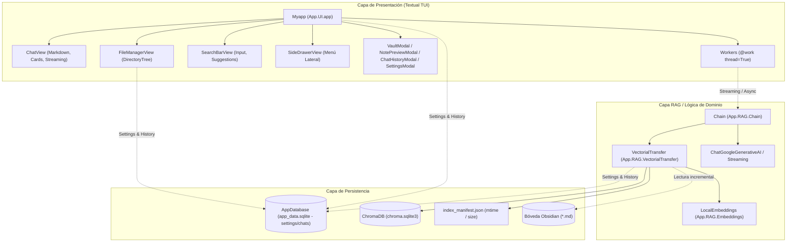

# Guía de Desarrollo para Agentes y Contribuidores: Lazy Obsidian

> **Documento de especificación técnica, arquitectura y directrices de código limpio para el desarrollo autónomo y asistido por IA en `lazy-rag-obsidian`.**

---

## 1. Propósito y Filosofía del Proyecto

**Lazy Obsidian** es una aplicación de terminal (TUI) diseñada para consultar bóvedas de notas de Obsidian en lenguaje natural mediante **RAG local e híbrido**. El usuario introduce una pregunta en su terminal y la aplicación recupera los fragmentos relevantes de sus notas privadas para generar una respuesta concisa, referenciando las fuentes exactas.

### Principios Fundamentales
1. **Velocidad Extrema y Respuesta Inmediata (First-Priority)**:
   - **TUI Ultra-Reactiva**: Toda TUI debe sentirse instantánea. Ninguna pulsación o envío debe bloquear el hilo principal.
   - **Streaming Token a Token**: Las respuestas generativas no esperan la culminación de la inferencia completa; transmiten tokens en tiempo real con `call_from_thread` reduciendo el *Time-to-First-Token* (TTFT).
   - **Bypass de Inferencia (Fast-Paths)**: Saludos, agradecimientos y comandos de control no deben activar embeddings ni retrieval vectorial innecesario.
2. **Terminal-First (TUI moderna)**: Interfaz ergonómica, atractiva y reactiva que no requiera abrir el navegador ni salir de la consola.
3. **Respeto por el recurso local**: Minimizar el consumo de memoria, eliminar dependencias pesadas e innecesarias (ej. evitar NLTK, PyTorch o librerías OCR no indispensables) y usar embeddings por lotes (*batching*).
4. **Local-First & Privacidad**: Las notas y vectores residen localmente; la llamada a LLM se limita a lo estrictamente necesario.

---

## 2. Mapa de Arquitectura

El sistema sigue una arquitectura por capas desacopladas:



### Estructura de Directorios

```text
lazy-rag-obsidian/
├── AGENTS.md               # Esta guía para agentes y desarrolladores
├── README.md               # Documentación general y puesta en marcha
├── OPTIMIZACION.md         # Registro de diagnóstico de performance y mejoras
├── TASK.MD                 # Tareas pendientes del backlog
├── main.py                 # Punto de entrada para ejecución
├── requirements.txt        # Dependencias de Python fijadas
└── App/
    ├── DB/
    │   ├── app_data.sqlite # Base SQLite relacional (configuraciones e historial de chat)
    │   ├── storage.py      # Capa de acceso a datos relacional SQLite
    │   └── Chroma/         # Almacenamiento vectorial persistente y manifiestos
    ├── RAG/
    │   ├── Chain.py        # Orquestación RAG, streaming y fast-path de saludos
    │   ├── Embeddings.py   # Cliente Ollama nativo con batching y prefijos
    │   └── VectorialTransfer.py # Sincronización incremental y cliente Chroma
    └── UI/
        ├── app.py          # Clase principal de Textual (Myapp), layout y streaming workers
        ├── theme.py        # Definición de paleta de colores y temas
        ├── CSS/            # Hojas de estilo Textual (TCSS) desacopladas
        └── components/     # Widgets modulares (chat, drawer, filemanager, history, prompt, settings)
```

---

## 3. Especificación Tecnológica: Textual (TUI) y Rendimiento

[Textual](https://textual.textualize.io/) es el motor reactivo de interfaz en terminal. Para mantener la aplicación responsiva, rápida y mantenible, todos los agentes deben ceñirse a las siguientes directrices:

### 3.1. Regla de Oro: Nunca Bloquear el Event Loop
Textual corre sobre un bucle de eventos asíncrono en el hilo principal. **Cualquier operación que tarde más de 16 ms (I/O de disco, consultas vectoriales, cálculo de embeddings, llamadas HTTP a Gemini u Ollama) DEBE ejecutarse en un Worker de segundo plano.**

### 3.2. Streaming en Vivo para Percepción de Velocidad
En interfaces de terminal interactivas, la latencia percibida (TTFT - *Time to First Token*) es más crítica que el tiempo total de generación.
- Los workers deben iterar sobre generadores (`chain.stream_search`) y despachar tokens al hilo principal mediante `self.call_from_thread(self._on_chunk_received, chunk)`.
- El widget de mensajes actualiza reactivamente el contenido (`Markdown.update(accumulated_text)`), permitiendo al usuario leer la respuesta inmediatamente a medida que se genera.

```python
# ✅ PATRÓN STREAMING RECOMENDADO EN TEXTUAL
@work(thread=True, exclusive=True, group="ask", exit_on_error=False)
def ask_worker(self, question: str) -> str:
    full_text = []
    for chunk in self.chain.stream_search(question):
        full_text.append(chunk)
        self.call_from_thread(self._on_chunk_received, chunk)
    return "".join(full_text)
```

### 3.3. Rutas Rápidas (Fast-Paths)
No todas las entradas del usuario requieren búsqueda vectorial o cálculo de embeddings.
- **Saludos y cortesía**: Respuestas inmediatas (< 1 ms) sin invocar Chroma ni Ollama.
- **Comandos de sistema** (`/vault`, `/help`, etc.): Ejecutados localmente en la UI sin pasar por la cadena RAG.

### 3.4. Arquitectura de Widgets y Comunicación Desacoplada
- **Eventos hacia arriba, propiedades hacia abajo**: Un widget hijo no debe mutar directamente a sus hermanos ni acceder a estructuras globales.
- **Custom Messages**: Para comunicar acciones entre componentes, define eventos que hereden de `textual.message.Message`.

### 3.5. Estilos con TCSS Desacoplado
- **Cero estilos inline en Python**: Toda propiedad visual debe vivir en archivos `.tcss` en `App/UI/CSS/`.
- **Diseño Responsivo con Breakpoints Fluidos**: Usar unidades fraccionarias (`1fr`) y alternar clases en `#main` según el tamaño de la terminal.
- **Tematización centralizada**: Utilizar los tokens semánticos definidos en `App/UI/theme.py`.

---

## 4. Capa RAG y Vectorstore (ChromaDB + Ollama)

Directrices de optimización de rendimiento:

1. **Apertura de Índice vs Construcción**:
   - `Chroma(...)` sólo abre el índice preexistente en `App/DB/Chroma`.
   - **NUNCA** llamar a `Chroma.from_documents(...)` en el camino de búsqueda.
2. **Indexación Incremental con Manifiesto**:
   - `index_manifest.json` rastrea `{archivo: [mtime, size]}`. Solo se procesan archivos nuevos, modificados o borrados.
3. **Ruta por Defecto de la Bóveda**:
   - La bóveda debe apuntar a la carpeta real de notas (ej. `/home/alerrsi/Documents/Obsidian`), nunca a carpetas padre masivas que contengan miles de archivos ajenos o repositorios git.
4. **Batching y Prefijos de Tarea**:
   - Ollama `nomic-embed-text` requiere prefijos `search_document:` para documentos indexados y `search_query:` para consultas de búsqueda.
5. **Locks de Concurrencia**:
   - Proteger el cliente de Chroma con `threading.Lock()` (`CHROMA_LOCK`) para prevenir *race conditions*.

---

## 5. Principios de Código Limpio (Clean Code)

### 5.1. Principio de Responsabilidad Única (SRP)
- **UI (`App/UI`)**: Sólo coordina componentes visuales, eventos de usuario y presentación.
- **RAG (`App/RAG`)**: Gestiona la lógica de embeddings, recuperación de texto, cadenas y streaming.
- **DB (`App/DB`)**: Manejo de archivos de disco, SQLite (`storage.py`), persistencia de Chroma y manifiestos.

### 5.2. Tipado Estático y Modern Python (3.12+)
- Uso consistente de `type hints`.
- Emplear `pathlib.Path` en lugar de concatenaciones manuales.

### 5.3. Resiliencia y Manejo Defensivo de Errores
- Prohibido silenciar excepciones con `except Exception: pass`.
- Emitir notificaciones amigables en la TUI sin provocar el cierre de la aplicación.

---

## 6. Arquitectura para la Escalabilidad

| Dimensión | Enfoque Actual | Guía de Escalabilidad Futura |
| :--- | :--- | :--- |
| **Streaming de Respuestas** | **Implementado**: streaming token a token vía `chain.stream` y `call_from_thread` en la tarjeta Markdown activa. | Optimizar re-renders en Markdown para streams de longitud extrema. |
| **Persistencia de Conversaciones** | **Implementado**: SQLite relacional (`app_data.sqlite`) con sesiones y mensajes normalizados. | Búsqueda全文 (FTS5) sobre el historial de chats pasados. |
| **Bóvedas grandes (>10.000 notas)** | Manifiesto local JSON con `mtime` | Migrar manifiesto a SQLite; indexación en chunks paralelos con hilos o procesos auxiliares. |
| **Proveedores LLM** | Gemini 2.5 Flash con streaming | Abstraer proveedor en protocolo común (`LLMProvider`) para alternar con Ollama local u otros proveedores. |

---

## 7. Protocolo de Trabajo para Agentes de IA

Antes de dar por terminada una tarea, verificar:
- [ ] **Sintaxis y compilación**: Ejecutar `python -m py_compile <archivos_modificados>`.
- [ ] **Importabilidad**: Validar importación de componentes sin demoras.
- [ ] **Rendimiento TUI**: Verificar que ninguna operación pesada corra en el event loop principal y que el streaming funcione fluidamente.
- [ ] **Preservar comentarios y docstrings preexistentes**.
- [ ] **Actualizar documentación**: Reflejar cambios en `TASK.MD` y `AGENTS.md`.
